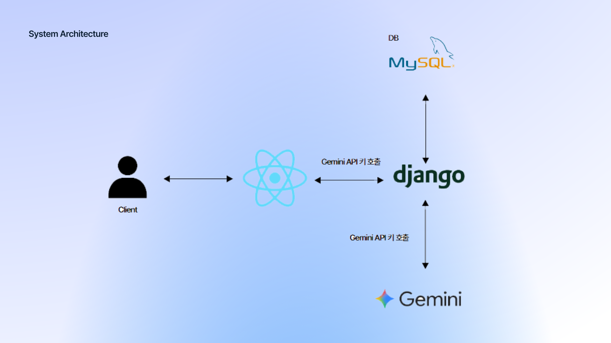

# 🚀 AutoPlanAI

**User-needs-driven AI platform for end-to-end planning → specs → benchmarking → team & Gantt → R&D plan → tool recommendations → code generation.**  
https://github.com/SY-20231230/AutoPlanAIv2
---

## 👥 Team Introduction

| Name             | Major                     | Role                      |
|------------------|---------------------------|---------------------------|
| **SungYong Yun** | Artificial Intelligence   | Project Manager / AI      |
| **JooEun Jeon**  | Artificial Intelligence   | Frontend Developer        |
| **JeYoung Jung** | Artificial Intelligence   | Backend Developer         |
| **SeungWoo Han** | Artificial Intelligence   | AI Engineer               |

---

## ✨ Key Features

- **Plan → Functional Specs (Dual Drafts)**  
  Generate **Spec v1** (multi-model checked) and **Spec v2** (refined) side-by-side for fast comparison.  
- **Similarity-Based Benchmarking (Hybrid: TF-IDF + Gemini API)**  
  Extract keywords from the chosen spec, retrieve candidates via **TF-IDF**, then use **Gemini API** for semantic expansion & **LLM re-ranking** to surface **Top-3 GitHub projects**.  
- **Team Role Assignment & Gantt**  
  Map members to roles/tasks and render a project timeline for coordination.  
- **R&D Plan Drafting**  
  Produce a structured first draft aligned with the selected spec and milestones **(based on Plan + Specs + Similar Top-3)**.  
- **Tooling Recommendations**  
  Suggest frameworks, libraries, and infra options tailored to project traits.  
- **Code Generation**  
  Output SQL and frontend scaffolds at usable quality; backend generation at prototype level (iterating).

### Current Status (Prototype)

| Capability                 | Description                                                            | Status        |
|---------------------------|------------------------------------------------------------------------|---------------|
| Functional Specs (v1/v2)  | Dual drafts (checked + refined)                                        | **Stable** ✅ |
| Similarity Benchmarking   | **Hybrid TF-IDF + Gemini API** (semantic expansion & LLM re-ranking)   | **Works** 🔄 |
| Team & Gantt              | Role mapping + timeline export                                         | **Usable** ✅ |
| R&D Plan Draft            | Structured first draft (user editing recommended)                      | **Usable** ✅ |
| Tool Recommendations      | Framework/library suggestions                                           | **Stable** ✅ |
| Code Generation           | SQL/FE usable; BE prototype                                            | **Improving** 🚧 |

---

## 🧭 Architecture & Flow

 

 

 

**E2E pipeline:** Idea/Plan → Spec v1 & v2 → Similar Projects (Top-3, TF-IDF + Gemini API) → Team Roles → Gantt → **R&D Plan Draft** → Tool Recommendations → Code (SQL/FE/BE)

##🛠️ Tech 

##🤖 Generative AI 

AI: Gemini 2.5 Flash

---

## 🧪 Usage (Web UI Flow — detailed)

[🔗Demonstration video](url)

1) **[New Project]**  
   Create a project from the home screen (name/description).

2) **Add Plan → [Analyze Plan]**  
   Paste your plan text or upload a file in **[Add Plan]**.  
   **Spec v1** (checked) and **Spec v2** (refined) are shown side-by-side.

3) **Find Similar Projects (Hybrid AI)**  
   Click **[Find Similar]** → TF-IDF retrieval + **Gemini API** semantic expansion & LLM re-ranking.  
   Shows **Top-3** GitHub repositories aligned with the selected spec.

4) **Team & Role Assignment**  
   In the **Team** tab, add members (Name / Major / Role preference) → **[Assign Roles]**.

5) **Build Gantt**  
   Click **[Build Gantt]** → timeline visualization.  
   Use **[Download]** to export the **Gantt as Excel (.xlsx)**.

6) **Generate R&D Plan Draft**  
   Click **[Generate Docs]** → **R&D plan draft** generated **from Plan + Specs + Similar Top-3**.

7) **Tool Recommendations**  
   Click **[Recommend Tools]** → framework/library suggestions.

8) **Code Generation**  
   **[Generate Code]** → SQL/Frontend (usable), Backend (prototype).

9) **Export**  
   Use **[Download]** to save Spec v1/v2, Similar Top-3, **Gantt (.xlsx)**, **R&D Draft**, and Code Bundle.

> Notes  
> • Generated documents are **drafts**; review/editing is recommended.  
> • Similarity is **Hybrid (TF-IDF + Gemini API)** and will keep improving.  
> • **Docs generation is R&D Plan only** for now (business/competition docs are planned).  
> • Backend code is **prototype** level for now.

---

## 🎯 Use Cases

- **Students & Researchers** — accelerate experimentation with fast specs, benchmarking, and an R&D draft  
- **Startup Teams** — Day-1 bootstrap from planning → specs → tools → code scaffold  
- **R&D Centers** — shorten proposal/report lead time via similar-project search + draft automation  
- **Hackathons & Competitions** — quickly generate core docs, Gantt, and code skeletons

---

## 🧱 Tech Stack & Models

- **Frontend**: React  
- **Backend**: Django  
- **AI/LLM**: Gemini API + GPT-OSS (self-hosted)  
- **Similarity**: TF-IDF retriever + Gemini semantic expansion & LLM re-ranking  
- **Database**: MySQL  
- **Timeline (Gantt)**: Excel (.xlsx) export

---

## 🔌 Integrations & Settings

- **Gemini API** — used for semantic expansion/re-ranking in similarity and for improving draft quality  
- **GitHub Search** — retrieves candidate repositories for benchmarking

> Open **Settings → env** to register your API keys.  
> In team/enterprise setups, keep keys on the server side (env/secret manager) only.

---

## 🔐 Privacy & Security

- **JWT required** — only authenticated users (via JWT) can view their own projects  
- Uploaded plans/team info are not retained beyond processing needs  
- API keys are managed **server-side**; never exposed to the client

---

## ❓ FAQ

**Q1. What’s the difference between Spec v1 and v2?**  
A. v1 is a multi-model checked draft; v2 is a refined/restructured version presented in parallel.

**Q2. Why is backend code “prototype-level”?**  
A. Backend needs vary widely by domain; current output focuses on scaffolding and will be hardened with templates/tests.

**Q3. Business/competition documents?**  
A. On the roadmap. For now, AutoPlanAI generates the **R&D plan draft** only.

**Q4. Can I switch to other LLMs?**  
A. Yes. The model adapter layer allows swapping/adding models (docs forthcoming).

---

## 🗺️ Roadmap

- [ ] Backend generation hardening (pattern templates, test stubs)  
- [ ] Vector DB integration (persisted embeddings, hybrid scoring)  
- [ ] Business/competition document templates  
- [ ] Domain-specific spec templates (bio/legal/defense)  
- [ ] Jira/Notion/GitHub Projects integrations  
- [ ] Quality pipeline (tests, static analysis, LLM-critic loops)

---

## 🤝 Contributing

Issues/PRs are welcome. When proposing features, include a **usage scenario** and **sample inputs** so we can reproduce your case.

---

## 🪪 License

Apache-2.0
